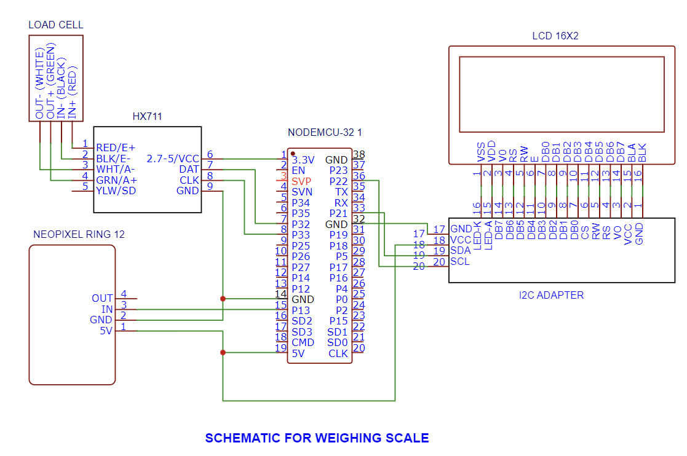
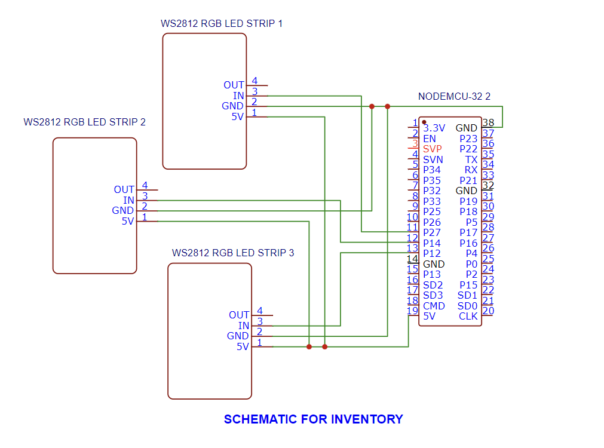
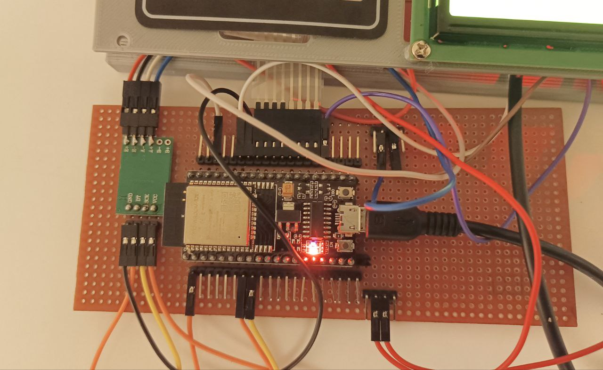

# Pick, Light, Weigh System 
A Tech4Good project for the clients and trainers at MINDS Bakers. 
  
Pick, Light, Weigh consists of a weighing scale which allows individuals with intellectual disabilities and limited numeracy skills to measure ingredients accurately. Users will also be able to select from a list of preset recipes from the scale’s interface.
  
It also features an intuitive traffic light system that illuminates based on the required weight of each ingredient, guiding users to precise measurements. Additionally, the scale integrates an inventory-picking system that lights up the corresponding ingredient that users are required to weigh, offering clear visual cues to provide more guidance.
  
## Workflow Overview
sheets > weighing scale > HiveMQ > inventory leds

  
## List of Hardware Required
### Weighing Scale Components 
- ESP32-WROOM 32E/Node MCU 32 x 1
- HX711 Load Cell Amplifier x 1
- 10kg Load Cell x 1 (Retrieved from an existing weighing scale) 
- 4x4 Matrix Membrane Keypad x 1 
- NeoPixel 12 LED Ring x 1
- 16x2 LCD Panel (Green/Blue backlight) x 1
- I2C Adapter for LCD x 1
- Continental MP3 module x 1
- Speaker 8 Ohms  0.5 W X 1
- Jumper Wires
- Header Pins (if vero board prototyping)
  
### Inventory Components 
- ESP32-WROOM 32E/Node MCU 32  x 1
- WS2812 RGB LED Light Strips x 3
- Jumper Wires
- Header Pins (if vero board prototyping) 
  

## Setup: Getting Google Sheets API
This project uses a Google API Key to access Google Sheets where the  recipes are stored.

### Step 1: Create Recipes File
Create a Google Sheets file in your Google Drive using the following format:

### Step 2: Create Google Cloud Platform (GCP) Project
Using the same email account as in Step 1, create a Google Cloud Platform (GCP) account. If you already have a GCP account, login to it.

Create a new GCP project.

### Step 3: Enable Google Sheets API
Open the Navigation Menu by clicking the icon in the top left corner. Select APIs & Services > Enabled APIs & Services.

Click Enable APIs and Services.

Search for Google Sheets API from the list of available APIs and select it.

Click Enable.

### Step 4: Create Google Sheets API Key
Select Credentials from the side menu.

Click Create Credentials.

An API Key with a unique string is created and shown on your screen. This key is to be kept confidential.
You should see your newly created API key as shown below. Click on it to set security restrictions.

Under API restrictions, click Restrict Key and select Google Sheets API from the list.

## Setup: Getting Started with Arduino IDE and ESP32
### Step 1: Download and Install Arduino IDE
Visit the Arduino IDE download page: https://www.arduino.cc/en/software

Download the appropriate version of Arduino IDE for your operating system (Windows, macOS, Linux).

Install Arduino IDE by following the on-screen instructions.

### Step 2: Clone Code from GitHub using GitHub Desktop
Download and install GitHub Desktop if you haven't already. You can get it from https://desktop.github.com/.

Open GitHub Desktop. Sign in to your GitHub account if you have one. If not, you can use GitHub Desktop without signing in, but signing in provides access to your repositories.

Click the "File" menu and select "Clone Repository..."

In the "Clone a Repository" window, you'll see a list of your GitHub repositories. Select 'MINDS-Baking'. If not, you can enter the repository URL (https://github.com/danialhbma/MINDS-Baking.git) or select "URL" and paste the repository URL.

Choose a local directory where you want to clone the repository by clicking the "Choose..." button under "Local Path."

Click the "Clone" button to start the cloning process. GitHub Desktop will download the repository to your local machine. After the repository is cloned, you'll see it listed in the GitHub Desktop application.
  
### Step 3: Open the Arduino Sketch
Open Arduino IDE.
Go to "File" > "Open."
Navigate to the directory where you cloned the GitHub repository and select the Arduino sketch file (main.ino). 
  
### Step 4: Configure ESP32 Board Settings
Go to "Tools" > "Board" and select your ESP32 board (e.g., "ESP32 Dev Module", "NodeMCU-32S").
Choose the correct "Port" (the USB COM port where your ESP32 is connected).
  
### Step 5: Installing the required dependencies
Go to "Library Managers" and search for the following libraries. Install the libraries.  
Some libraries mentioned in the code are not included in the list as they are already preinstalled in the Arduino IDE.  
* HX711 Arduino Library by Bogdan Necula
* ArduinoJson by Benoit Blanchon
* PubSubClient by Nick O' Leary
* LiquidCrystal_I2C by Marco Schwartz (library zip can be downloaded from https://randomnerdtutorials.com/esp32-esp8266-i2c-lcd-arduino-ide/)
* Adafruit NeoPixel by Adafruit 
  
### Step 6: Uploading the Code
Click the "Upload" button (right arrow icon) in the Arduino IDE.
Wait for the code to compile and upload to your ESP32 board. The progress will be displayed in the bottom status bar.
Once the upload is complete, you should see "Done uploading" in the status bar.
  
### Step 7: Verify and Monitor
Open the Serial Monitor in Arduino IDE (Tools > Serial Monitor) to view debug messages and program output.
Ensure that the uploaded code is running correctly on your ESP32 board.
  
## Setup: Connecting the hardware
### Breadboard Connection  
Before assembling the circuit on a veroboard/proceeding to PCB prototyping, you may test the components using a breadboard instead.  
Note that for full breadboards, there is a break in the wire connection in the middle of the board. 
  
_Source:_ [ThePiHut](https://thepihut.com/blogs/raspberry-pi-tutorials/27968772-turning-on-an-led-with-your-raspberry-pis-gpio-pins) 
  
### Load Cell Calibration
To use the code in the "main" file, you will be required to determine your calibration factor. This calibration factor serves to scale your HX711 readings to accurate weight. Use standard weights for optimum results.  
More information on determining the calibration factor can be found at https://randomnerdtutorials.com/esp32-load-cell-hx711/
  
### Assembling the Circuit  
Assemble the circuit following the schematics below. To connect between components, make use of jumper wires and header pins. 
  

After testing the circuit with the code, you can solder the components on a veroboard. Veroboard prototyping prevents loose connections and allows the circuit to be placed within the 3D-printed housing.   

 
  
## Weighing Scale System
The Weighing Scale System is the portion of the project that contains the logic to get the weight of the measured ingredient, ensure it matches the desired weight from the recipe, and light up the LED according to the measured weight. All recipe information is linked to a Google Sheet and retrieved using a Google Sheet API key.

If the measured weight is below the desired weight, the LED will turn orange:

If the measured weight is correct, the LED will turn green:

If the measured weight is above the desired weight, the LED will turn red:

  
### How It Works
**1. Setup State**
The ESP32 in the Weighing Scale System connects to the provided Wi-Fi endpoint to retrieve recipes from the connected Recipes Google Sheet file. The returning JSON data is parsed and stored in a Recipe struct.

**2. Recipe Selection State**
Users input their desired recipe number and press "Confirm" to select a recipe, which will bring them to the Confirmation State.

**3. Confirmation State**
The weighing scale will display the desired recipe name on the LCD panel. Users can either confirm their selection to proceed to the Weighing State or cancel to return to the Recipe Selection State.

**4. Weighing State**
Upon confirming their selection, the scale will enter the Weighing State. It will retrieve the desired recipe from the list of stored recipes in the Recipe struct. The ingredient name will be displayed on the LCD panel, and the Inventory Picking System will light up the corresponding LED for the ingredient. After users have picked the ingredient, placed their bowl and tared its weight, they can begin weighing the selected ingredient.

The LED will initially be orange, as the measured weight is below the desired weight. However, if the measured weight exceeds that of the desired weight, the LED will turn red. The LCD panel will display the weight offset between the desired weight and measured weight (desired weight - measured weight) to indicate how many more grams of the ingredient need to be added. 

When the desired weight is reached, the LED will turn green. Users can press the "Next" button to proceed to weigh the next ingredient and repeat the process until there are no more ingredients to be weighed.

  
## Inventory  Picking System
The Inventory Picking System is the portion of the project that contains the logic to light up the LED strips that are assigned to an ingredient. 
  
### How It Works
The ESP32 in the Inventory System subscribes to the **Inventory** topic on HiveMQ, which retrieves published messages (ingredient names) from the Weighing Scale System. 
Each ingredient in the recipe list has a corresponding LED strip number. If the ingredient in the published message matches an ingredient that contains an LED strip, the LED strip will light up, alerting users that they are supposed to weigh that ingredient next. 
  
### Including more ingredients 
Based on the current implementation, pins 27, 14, and 12 are currently used to connect to the LED strips.

_Source:_ [ESPRESSIF](https://docs.espressif.com/projects/esp-idf/en/latest/esp32/_images/esp32-devkitC-v4-pinout.png)

To support more ingredients, WS2812 RGB LED Light Strips can be purchased and attached to the unused GPIO pins as seen in the pin layout diagram above. You'll also need to provide power (5V) and ground (GND) connections to the LED strip to power it.

More comments and instructions on the expandability of the inventory system can be seen in the **main.ino** file under the "main" subdirectory in the "Inventory System" folder.
  
##  Future work 
### Software
* Optimisation of code to improve response timing of components E.g Resolve lag in the MQTT inventory system
* Improve on traffic light system. E.g Using a progress bar to indicate weighing progress, changing led colours to create more contrast between stages
### Hardware 
* Adding "offset" input in Google Sheets to provide another degree of customisation without the trainers needing to edit the code. The "offset" input will allow trainers to vary the precision of the weighing scale according to their needs
* Proceed to PCB prototyping
* Redesigning of hardware for inventory light system such that it is fitted for large-scale application (i.e. Used for more than 3 ingredients). Look into mechanical/automation if required.
* Replace USB power source with rechargeable battery/direct plug
### Aesthetics and Usability 
* Redesigning of weighing scale casing of weighing scale for modularity and ease of maintenance
* Design a mount for lights to be mounted onto shelves with ingredients 
* Reduce the number of buttons to prevent confusion 
